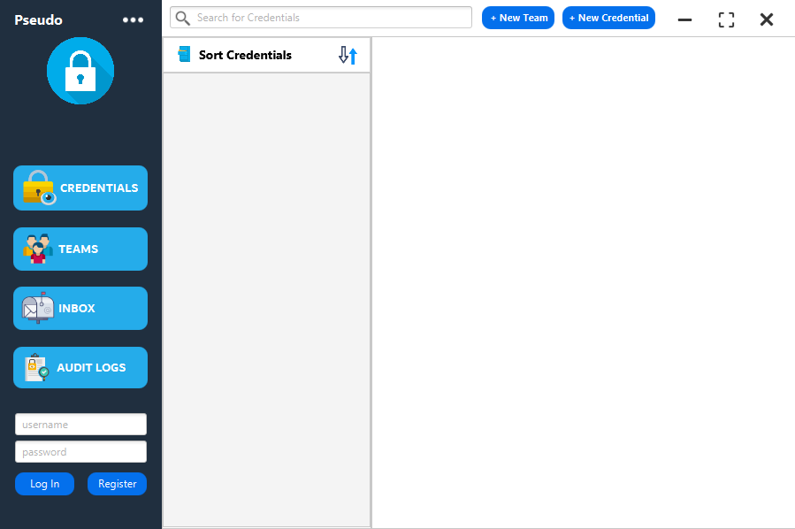
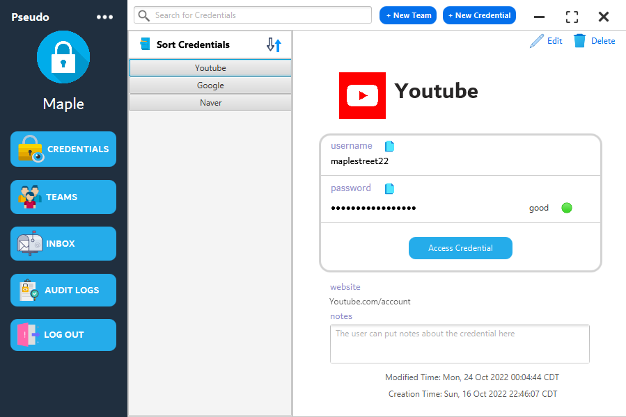
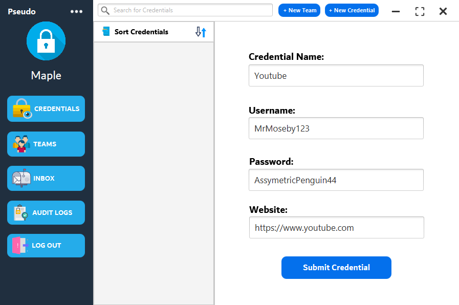
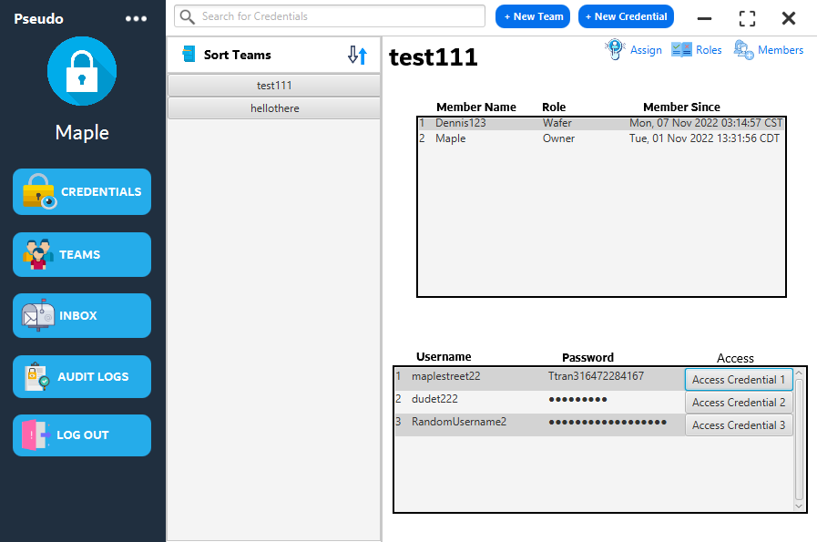
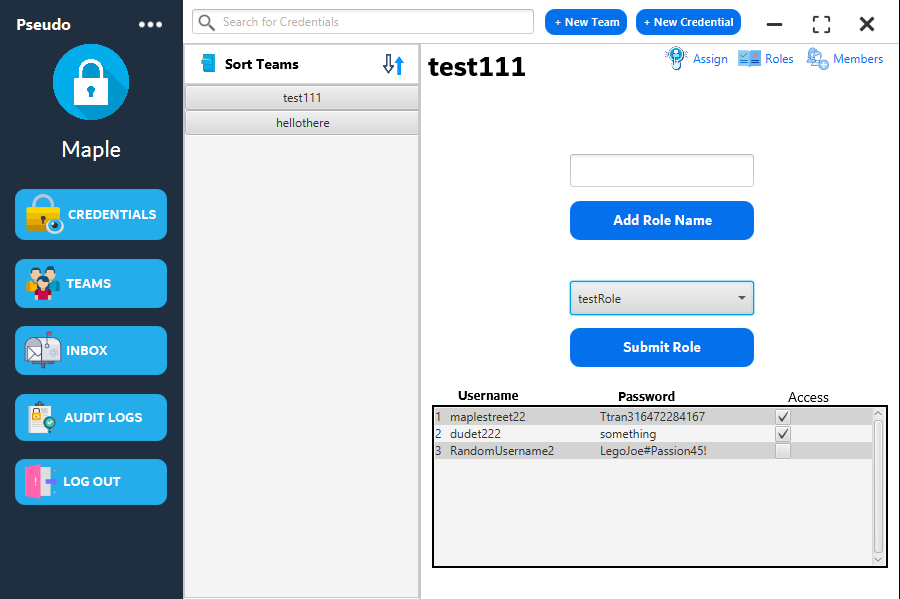
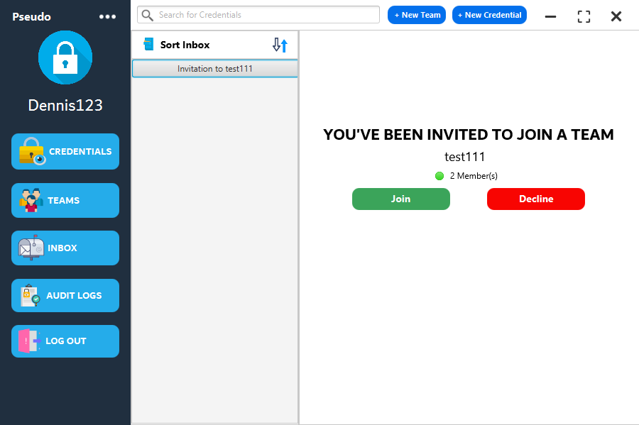
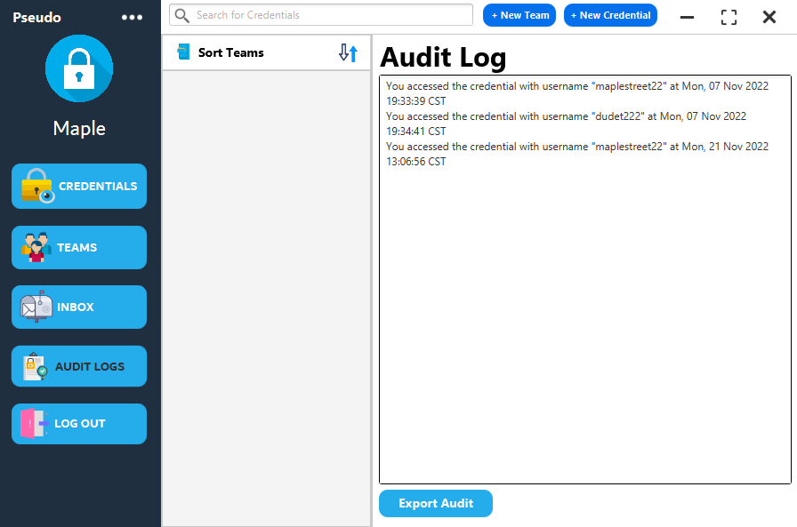
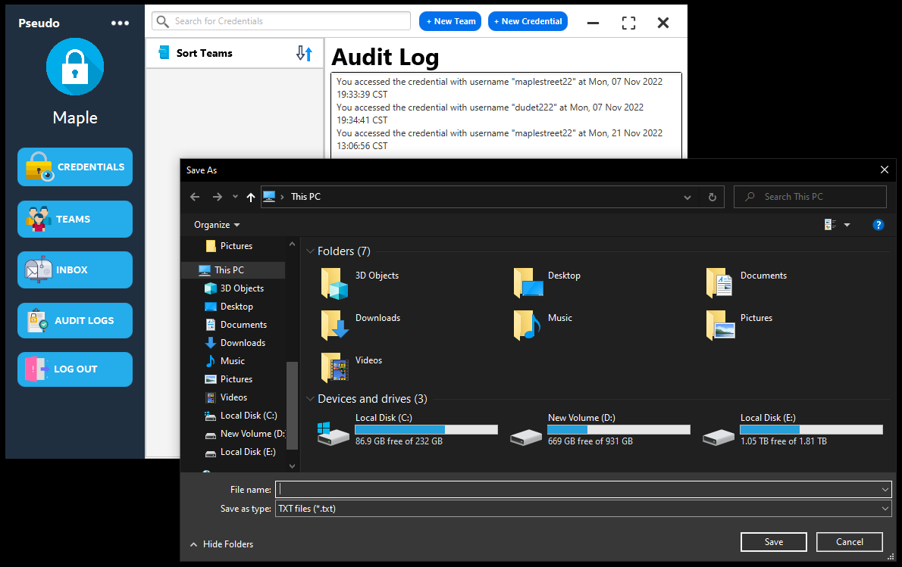

# Authors

- [Brandon Pearson](https://github.com/blpearson26) - Cyber Security
- [Dennis Tran](https://github.com/DennisTran00)    - Computer Science
- [Addison Burkett](https://github.com/westvalard)  - Cyber Security
- [Kyle Parker](https://github.com/CraftyAmigo)     - Software Design & Development

# Background
The purpose of this product is to provide individuals, teams, and organizations with an easy-to-use, secure credential sharing solution. There are two main focuses for the Password Manager. 
* First, it will eliminate the hassle and security lapses of having to memorize/maintain passwords with a centralized vault for user credential storage and access. 
* Secondly, it will provide credential sharing ability with real-time alerts on credential access. 

With the Password Manager, users will be able to set up hierarchical systems in which specific users can be granted access to resources and credentials. When administrators change credential information, the software will automatically update passwords of any resources that are shared to other members. Additionally, administrators get privileged access to audit logs which display a record of credential access from all members.

Project Submission Structure
============================
> Folder structure has been split into detailed section for ease of understanding

### Top-level directory

    .
    ├── PassMnger                 # Project files
    ├── images                    # image files for the README.md
    ├── .gitignore
    └── README.md
    
### Source files
    .
    ├── PassMnger
    │   ├── src
    │   │   ├── main
    │   │   │   ├── java
    │   │   │   │   ├── Main          # Package that contains the launch application and GUI file
    │   │   │   │   ├── credential    # Package for credential isntances used to save user credentials
    │   │   │   │   ├── database      # Contains the database connection class for database access
    │   │   │   │   ├── gui           # Package for the GUI controller class
    │   │   │   │   ├── invites       # Package for invitation instances to add users to a team (feature)
    │   │   │   │   ├── role          # Package for creating role instances for team credential privileges 
    │   │   │   │   ├── team          # Package for team instances and storing information about created teams
    │   │   │   │   └── user          # Package for user isntances when a user registers an account
    │   │   │   └── ... 
    │   │   └── ... 
    │   └── ... 
    └── ...

<b>Package Details</b>

#### Main
    .
    ├── Main
    │   ├── PasswordManager.java        # The main launch application (creates the JavaFX Stage)
    │   ├── PasswordManagerGUI.fxml     # FXML file exported from SceneBuilder GUI creator
    │   └── Style.css                   # CSS file that formats fxml elements in the GUI
    
 #### credential
    .
    ├── credential
    │   ├── Credential.java             # Stores information about user added credentials
    │   └── CredentialInterface.java    # Methods for defining the behavior of Credential
    
 #### database
    .
    ├── database
    │   └── DBConnection.java           # Creates a connection to the database and has querying methods
    
 #### gui
    .
    ├── gui
    │   ├── InfoList.java                     # Updates the thumbnail list in the GUI
    │   └── PasswordManagerController.java    # Controller class that is linked to the FXML file
 
 #### invites
    .
    ├── invites
    │   ├── Invite.java                 # Stores information about team invitiations sent to other users
    │   └── InviteInterface.java        # Methods for defining the behavior of Invite
    
  #### role
    .
    ├── role
    │   ├── Role.java                   # Stores information about team role privileges
    │   └── RoleInterface.java          # Methods for defining the behavior of Role
 
   #### team
    .
    ├── team
    │   ├── Team.java                   # Stores information about a user created team
    │   └── TeamInterface.java          # Methods for defining the behavior of Team
    
   #### user
    .
    ├── user
    │   ├── User.java                   # Stores information about every user that registers
    │   └── UserInterface.java          # Methods for defining the behavior of User
 
 ### Resource Icons
 > Icons used in the Graphical User Interface can be found in the `res` pacakge by following the path: src > main > java > res.
 

 
Screenshots
============================

<b>Initial Startup</b>
 

<b>Credential View</b>

<b>Team View</b>

<b>Inbox with team invitiation</b>

<b>Audit Log</b>

    
